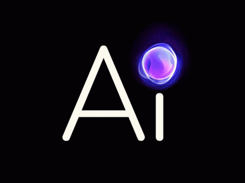

## 🎯This RAG AI Architecture is trending on data science notes like libraries numpy ,pandas ,matplotlib Notes And Data collection and ML DL Notes etc.

## Step 1--> Collect The PDFs 
We Collected The PDFs and merged then into one PDF

## Step2-->Text Extract 
And From the post We Collected a txt File

## Step3-->Convert Txt To json
After That We Made A Json Which We Merge the data 

## Step4--> Convert the json file to Vectors
use the file preprocess_json to convert the json file to a Dataframe with embedding  as save it as a joblib pickle

## Vector Database 5-->5 Read The joblib file and load it into the memory
Read The joblib file and load it into the memory. then create a relevant prompt as
per the user query and feed it the LLM

## Full Architecture Flow Chart

#  This Is Normally Pipeline Of Ai Architecture
     ___________
    |   PDF     |
    |___________|
          ↓  
    _____________
    |Text Extract|
    |____________|
          ↓
    _____________    
    |   JSON    |
    |___________|
         ↓
    ______________
    |Embeddings  |
    |____________| 
          ↓
    _________________
    |Vector Database|
    |_______________|
         ↓
    ____________________
    |Similarity Search |
    |__________________|
         ↓
    ___________   
    |LLM Answer|
    |__________|
